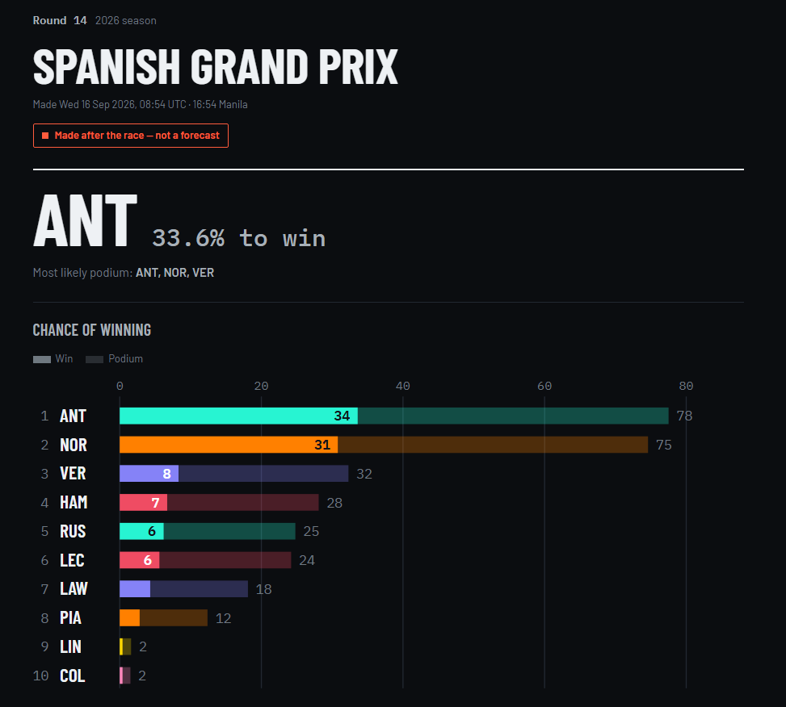
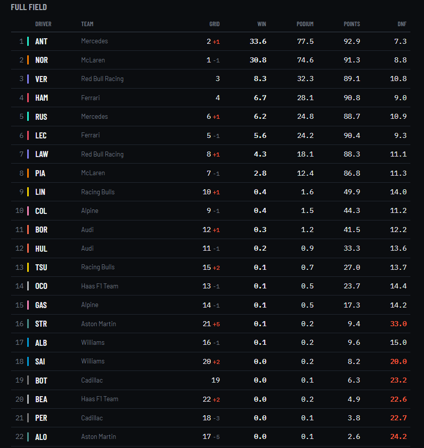

# f1-prediction

Predicts an F1 race once qualifying is done: the finishing order, plus each driver's chance of
winning, reaching the podium, scoring points, or retiring. Saves it as a web page you can open on
your phone or send to someone.





## What it's actually good at

Straight answer: it doesn't predict the finishing order any better than assuming everyone finishes
where they started. That was tested properly, across 48 races in the 2024 and 2025 seasons, model
against grid, race by race. Everything landed inside the margin of error, and a couple of variants
came out worse.

The percentages are the real output, and a starting grid can't give you those. The grid tells you
Norris starts first. It can't tell you he's 31% to win, or that Stroll has a 33% chance of not
finishing. Those numbers hold up against races that already happened: across 2025 the eventual
winner scored 1.19 on log loss, against 2.99 for treating every driver as equally likely.

The retirement estimate is the weak one. Over 2025 it scores exactly the same as just using the
field's average failure rate, so no better. It only pulls ahead in 2026 (0.139 against 0.149), when
reliability shifted and a per-driver estimate started to matter.

So read the order as "the grid, give or take", and pay attention to the numbers next to it.

## A race weekend

Run it after qualifying and before the race, since qualifying is what it works from. Timing data
takes a few minutes to land, so give it about 90 minutes after the session starts.

```
python -m f1pred weekend 2026 16
```

That fetches the new sessions, rebuilds, predicts and writes `data/processed/predictions/2026_R16.html`.
Open it in any browser. If qualifying isn't out yet it stops and says so; add `--wait 60` to keep
retrying every 5 minutes for up to an hour.

The same thing as separate steps, e.g. to re-run just the prediction after adding a penalty:

```
python -m f1pred fetch --seasons 2026 --rounds 16
python -m f1pred build
python -m f1pred predict 2026 16 --no-refresh
python -m f1pred report 2026 16
```

Use the round number rather than the race name. A number is used as-is, while a name gets
fuzzy-matched and can quietly land on the wrong event.

Once the race is over, `python -m f1pred score --refresh` tells you how it did.

**Grid penalties you have to enter yourself:**

```
python -m f1pred weekend 2026 16 --penalty VER=5 --pitlane STR
```

That's not laziness. Penalties never appear in the timing data. I checked the two biggest grid drops
in the dataset, Antonelli falling 12 places at Monza and Hadjar 11 at Spa, and neither is mentioned
anywhere in the qualifying messages. They live in FIA stewards' documents, which FastF1 doesn't
carry. So glance at the F1 site after qualifying, otherwise the model assumes everyone starts where
they qualified.

**Run it before the race starts.** Once the result exists, `predict` refuses, since a prediction made
in hindsight doesn't count when you score it. `--backfill` saves one anyway.

## The other commands

`fetch` on its own downloads every season from 2022 to now. It's resumable, skips what it already
has, and ignores sessions that haven't happened yet. FastF1 allows 500 calls an hour so a full
download takes a few hours, but week to week it only grabs the new sessions.

`build` combines the downloads and runs sanity checks. `backtest` replays past races, which is the
only honest way to tell whether a change helped.

## How it works

Practice, qualifying, sprint and race sessions from 2022 on. Telemetry is never loaded, since it was
97% of the storage and lap times already carry the pace.

The model mostly looks at the grid and qualifying: grid slot, pit-lane start, qualifying position,
gap to pole, gap to teammate. On top of that it gets one pace estimate: where the driver ranks on
practice lap time, recent finishes and the team's recent qualifying, and how far behind that they're
starting. That's for the fast car stuck at the back, like Antonelli going from 19th on the grid to a
win at Monza. It improved the 2024 and 2025 backtests but not the (shorter) 2026 one.

Raw practice pace, recent form, career record and track history are all built and available, just
switched off, because on their own they made things worse. With about 100 races to learn from, the
model memorises those features instead of learning from them.

Underneath it's an `XGBRanker` in pairwise mode, so it learns to order drivers within a race rather
than guess each position on its own. The percentages come from simulating each race 20,000 times
from those scores, with the spread tuned on how the top three actually finished recently. A separate
model estimates each driver's chance of retiring and drops them to the back.

Every measurement is walk-forward, so predicting a race only ever uses races that happened before
it. Tests in `tests/test_features.py` guard against leaking future information.

## Upkeep

Each new season, add a row per team to `reference/power_units.csv`. `build` warns if one is missing.
When the regulations change (next expected 2031), add that year to `ERA_STARTS` in
`src/f1pred/config.py`, since races from the same era get 3x training weight when the pecking order
resets.

The retirement model gives races from the current era 10x weight, because reliability resets with new
cars. Without that it predicted about 14% retirements in 2026 against a real 18%; with it, 17%.

## Setup

```
python -m venv .venv
.venv\Scripts\activate
pip install -r requirements.txt
pip install -e .
pytest
```

The notebooks need Jupyter on top: `pip install -r requirements-dev.txt`, then pick the `.venv`
kernel.

## Layout

```
src/f1pred/   fetch, build, features, model, evaluate, probabilities, dnf, predict, report, score
tests/        leakage, metric, penalty, scoring and page tests
notebooks/    exploration and review only
reference/    power_units.csv, engine supplier per team per season
```
